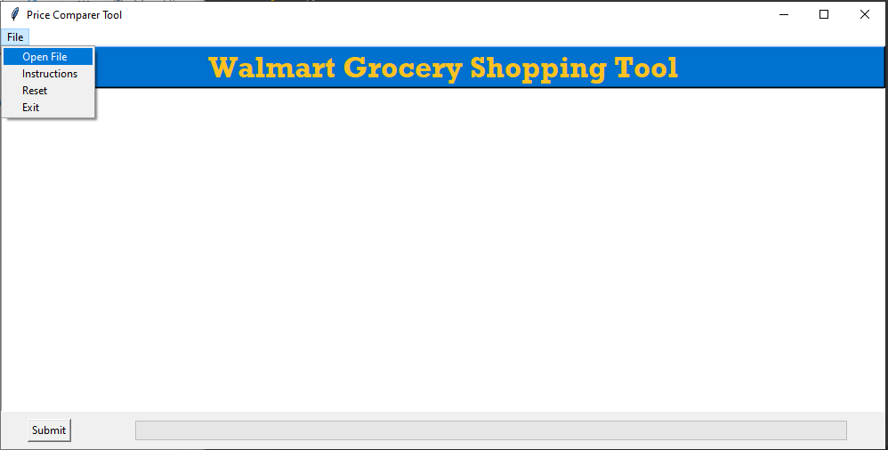
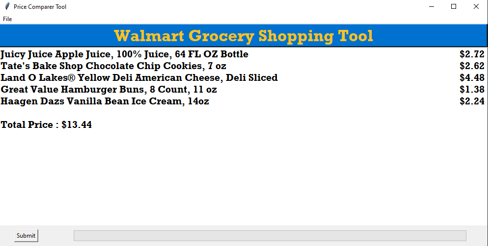
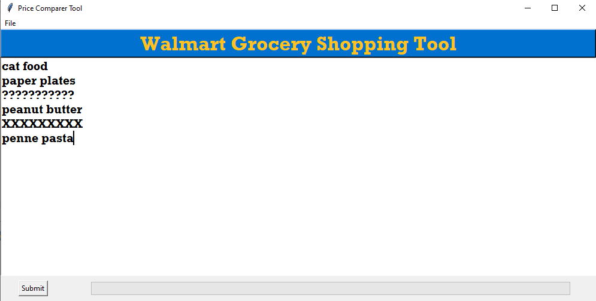
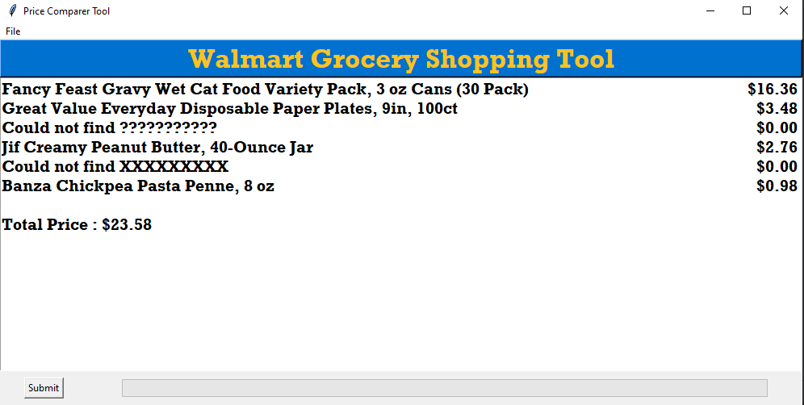

# Walmart-Shopping-Tool

## Overview
This tool can be used to determine which combination of items and brands results in the cheapest cart based on your shopping list. 
This tool is extremely helpfull to shoppers on a budget who need to quickly determine exactly which products they need to get to fulfill their shopping list without breaking the bank.

## Processing From A Text File
A text file containing a grocery list item on each line can be uploaded to the program and processed. The text file being filtered is as follows ...

* apple juice
* chocolate chip cookies
* american cheese
* hamburger buns
* vanilla ice cream

  
  

## Processing From Manual Input
The grocery list items can be manually inputted into the program via a textbox. If an item uploaded is not found on the walmart website then the program handles this exception and ignores that item. 

  
  

### Features
* An easy to use GUI allows for customers to either upload a grocery list from a textfile or enter it in directly into the app
* A progress bar is updated as the grocery list is parsed through
* The exact price and brand for each grocery list item  is outputted to the gui 
* The total price of the shopping cart is outputted to the bottom of the screen as well
* If an item is not found then "Cannot find item X" is outputted to the screen and the item is ignored
* A reset button allows for a user to process multiple grocery lists

## Technical Details
The webscraper was built using a combination of two main libraries, **Requests** and **Beautiful Soup**.

**Requests** is a HTTP library for Python which is used to make an HTTP request to the Walmart website and store the HTML elements.

**Beautiful Soup** is a Python library used to extract usefull data from the HTML elements.

A grocery list is parsed through, and HTTP requests are sent for each item. Name and price data is extracted for all the products related to that item, and if no products are found then the item is ignored and an "not found" message is displayed to the screen.
The minimum cost product is determined and displayed for each grocery list item, and the total cost of the shopping cart is calculated and displayed as well.

The GUI was built using the **Tkinter** library.
